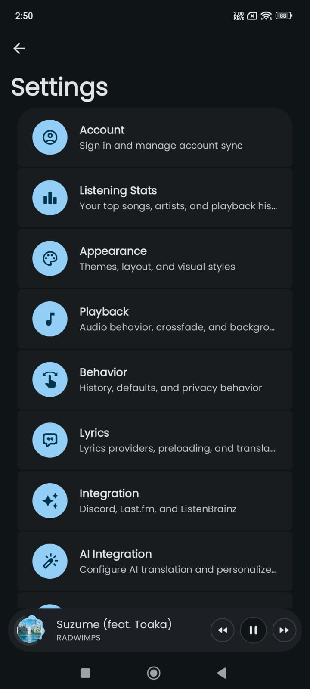
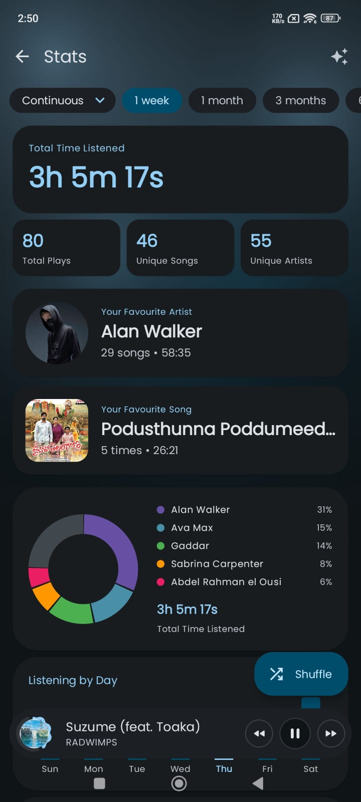

<div align="center">

  

  # NomaTune

  ### The Material 3 Expressive Music Player

  **Stream. Save. Loop. Repeat.**

  A modern Android music player with YouTube Music integration, local file playback, synced lyrics, offline downloads, and a clean Material 3 Expressive interface.

  [](https://www.gnu.org/licenses/gpl-3.0)
  [](https://www.android.com)
  [](https://github.com/Shahdullah/NomaTune/releases)
  [](https://github.com/Shahdullah/NomaTune/stargazers)

  [**📥 Download**](https://github.com/Shahdullah/NomaTune/releases/latest) • [**🌐 Website**](https://nomatune.vercel.app) • [**🐛 Report Bug**](https://github.com/Shahdullah/NomaTune/issues)

  </div>

  ---

  ## ✨ Features

  ### 🎧 Playback
  - Ad-free streaming with background listening
  - Multiple account support with quick switching
  - Local file & playlist support
  - Fast startup, lightweight performance
  - EBU R128 loudness normalization
  - Tempo, pitch, and playback speed controls
  - Crossfade between tracks
  - System equalizer & spatial audio

  ### 🎤 Lyrics & Discovery
  - Live synced lyrics
  - AI translation & romanization
  - Music recognition (Shazam-style)
  - Real-time listening statistics
  - Import playlists from Spotify
  - YouTube Music account sync
  - Last.fm scrobbling
  - ListenBrainz history sync
  - Discord rich presence

  ### 🎨 Design
  - Material 3 Expressive design language
  - Album-art powered dynamic colors
  - 9 different player styles
  - 8 different player background styles
  - Responsive layouts for any screen
  - Clean browsing, player, artist, album, and lyrics views

  ### ⚙️ Customization
  - Deep playback & interface settings
  - Dynamic color theming
  - Gesture customization
  - Animation & layout tuning
  - Flexible controls

  ---

  ## 📱 Screenshots

  <p align="center">
    
    
    
    
  </p>
  <p align="center">
    
    
    
  </p>

  ---

  ## 📥 Installation

  ### 🔽 Direct APK
  1. Go to [Releases](https://github.com/Shahdullah/NomaTune/releases/latest)
  2. Download the APK for your device (arm64 recommended for most phones)
  3. Install on your Android device (enable "Install from unknown sources")

  ### 📦 Coming Soon
  - F-Droid
  - IzzyOnDroid
  - Obtainium

  ---

  ## 🛠️ Building from Source

  ### Requirements
  - Android Studio Ladybug or newer
  - JDK 21
  - Android SDK 37

  ### Steps
  ```bash
  git clone https://github.com/Shahdullah/NomaTune.git
  cd NomaTune
  ./gradlew assembleGmsMobileUniversalRelease
  ```

  ---

  ## 📄 License

  This project is licensed under the **GNU General Public License v3.0** — see [LICENSE](LICENSE) for details.

  © 2026 Shahdullah — [github.com/shahdullah](https://github.com/shahdullah)

  </div>