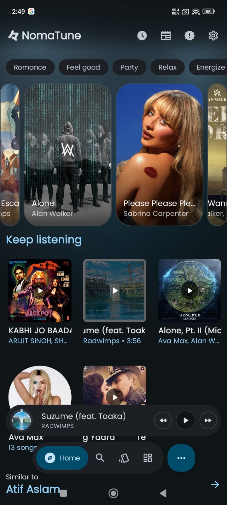
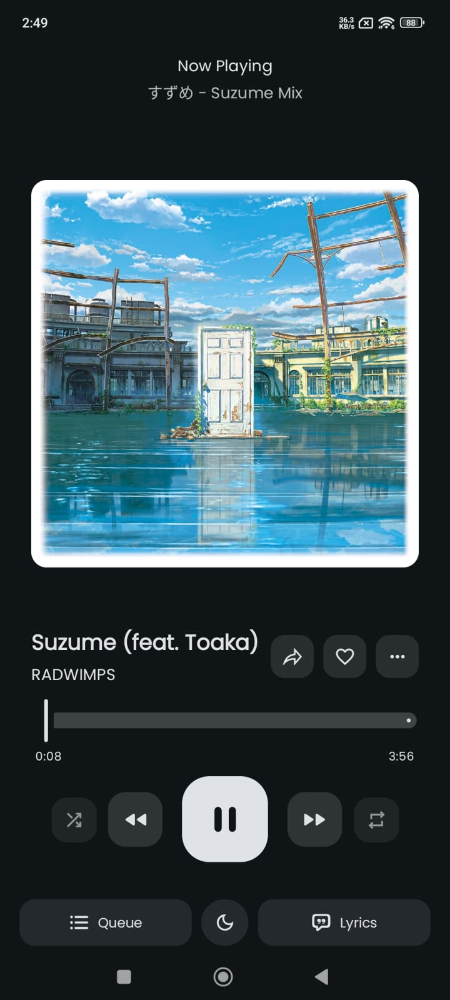
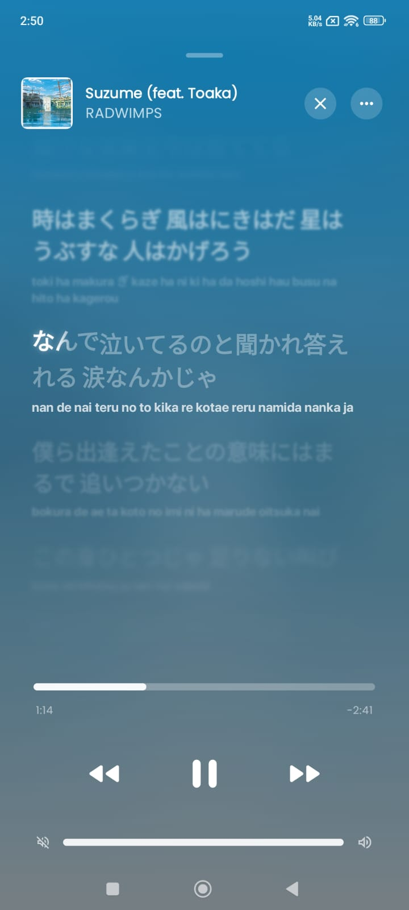
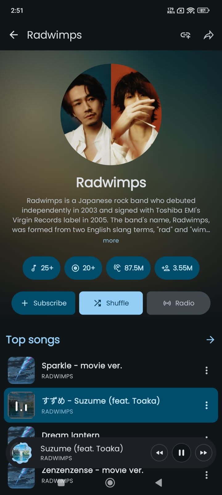
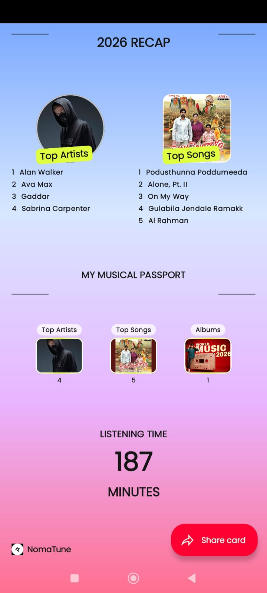
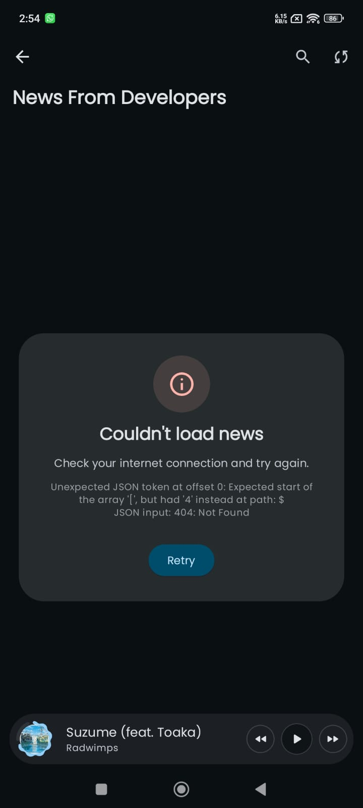

<div align="center">


# NomaTune

### The Material 3 Expressive Music Player

**Stream. Save. Loop. Repeat.**

A modern Android music player with YouTube Music integration, local file playback, synced lyrics, offline downloads, and a clean Material 3 Expressive interface.

[](https://www.gnu.org/licenses/gpl-3.0)
[](https://www.android.com)
[](https://github.com/Shahdullah/NomaTune/releases)
[](https://github.com/Shahdullah/NomaTune/stargazers)

[**📥 Download**](https://github.com/Shahdullah/NomaTune/releases/latest) • [**🌐 Website**](https://nomatune.vercel.app) • [**🐛 Report Bug**](https://github.com/Shahdullah/NomaTune/issues)

</div>

---

## ✨ Features

### 🎧 Playback
- Ad-free streaming with background listening
- Multiple account support with quick switching
- Local file & playlist support
- Fast startup, lightweight performance
- EBU R128 loudness normalization
- Tempo, pitch, and playback speed controls
- Crossfade between tracks
- System equalizer & spatial audio

### 🎤 Lyrics & Discovery
- Live synced lyrics
- AI translation & romanization
- Music recognition (Shazam-style)
- Real-time listening statistics
- Import playlists from Spotify
- YouTube Music account sync
- Last.fm scrobbling
- ListenBrainz history sync
- Discord rich presence

### 🎨 Design
- Material 3 Expressive design language
- Album-art powered dynamic colors
- 9 different player styles
- 8 different player background styles
- Responsive layouts for any screen
- Clean browsing, player, artist, album, and lyrics views

### ⚙️ Customization
- Deep playback & interface settings
- Dynamic color theming
- Gesture customization
- Animation & layout tuning
- Flexible controls

---

## 📱 Screenshots

<p align="center">
  
  
  
  
</p>
<p align="center">
  
  
  
  
</p>

---

## 📥 Installation

### 🔽 Direct APK
1. Go to [Releases](https://github.com/Shahdullah/NomaTune/releases/latest)
2. Download the latest `nomatune-foss-release.apk` (for FOSS users) or `nomatune-gms-release.apk` (with Google services)
3. Install on your Android device (enable "Install from unknown sources")

### 📦 Coming Soon
- F-Droid
- IzzyOnDroid
- Obtainium

---

## 🛠️ Building from Source

### Requirements
- Android Studio Ladybug or newer
- JDK 21
- Android SDK 37

### Steps
```bash
# Clone the repo
git clone https://github.com/Shahdullah/NomaTune.git
cd NomaTune

# Build debug APK
./gradlew assembleFossDebug

# Build release APK (requires signing key)
./gradlew assembleFossRelease
```

The APK will be at `app/build/outputs/apk/foss/debug/`.

### Build Variants
- `foss` — FOSS build (no Google services, F-Droid friendly)
- `gms` — Build with Google services (for Play Store)
- `izzy` — Build for IzzyOnDroid

---

## 🚀 Auto-Release via GitHub Actions

Push a tag like `v1.0.0` and GitHub Actions will automatically:
1. Build both `foss` and `gms` release APKs
2. Create a GitHub Release
3. Attach the APKs as downloadable assets

```bash
git tag v1.0.0
git push origin v1.0.0
```

### 🔐 Signing Setup (Optional)
For signed releases, add these GitHub Secrets to your repo:
- `KEYSTORE_BASE64` — base64-encoded keystore file
- `KEYSTORE_PASSWORD` — keystore password
- `KEY_ALIAS` — key alias
- `KEY_PASSWORD` — key password

Generate a keystore:
```bash
keytool -genkey -v -keystore nomatune.jks -keyalg RSA -keysize 2048 -validity 10000 -alias nomatune
base64 nomatune.jks > nomatune.jks.base64
```

---

## 🤝 Contributing

Contributions, issues, and feature requests are welcome! See [CONTRIBUTING.md](CONTRIBUTING.md).

---

## 📜 License

```
NomaTune is licensed under the GNU General Public License v3.0
You may copy, modify, and distribute this software under the terms of the GPL-3.0.
See LICENSE for the full license text.
```

---

## 👤 Author

**Shahdullah**
- GitHub: [@Shahdullah](https://github.com/Shahdullah)

---

<div align="center">

**Made with ❤️ and 🎵**

⭐ Star this repo if you find it useful!

</div>
